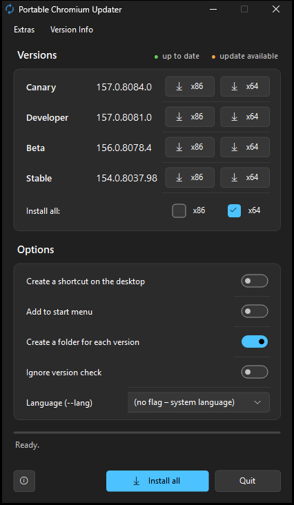

# Portable Chromium Updater

A small Windows program that downloads **Chromium** in the channels **Canary, Developer, Beta and Stable** (each x86 and x64) and installs it as a **portable version** – no installer, nothing written to `%LOCALAPPDATA%`, one self-contained folder per version.



## Download

- **[Latest release](https://github.com/naderi/portable-chromium-updater/releases/latest)** – download `ChromiumUpdater.exe`, put it into an empty folder where the browsers should go (e.g. `D:\Apps\Chromium`) and run it. No installation needed.
- Or with [Scoop](https://scoop.sh):

  ```
  scoop bucket add naderi https://github.com/naderi/scoop-bucket
  scoop install naderi/portable-chromium-updater
  ```

  With Scoop, keep **Create a folder for each version** switched on (the default): the version folders, the settings and the shared profile are kept across `scoop update`.

**Requirements:** Windows 10 or 11 with .NET Framework 4.5 or later (preinstalled on Windows 10/11).

## How it works

Chromium itself has no release channels, so the updater maps every Chrome channel to the matching Chromium build:

1. [chromiumdash](https://chromiumdash.appspot.com/releases?platform=Windows) provides the current Chrome version of each channel and its **Chromium branch position**.
2. In Google's official `chromium-browser-snapshots` storage (`Win` = x86, `Win_x64` = x64) the updater looks for the **newest snapshot build at or before that position**.
3. Its `chrome-win.zip` is downloaded and extracted.

> **Note:** The version shown is the Chrome version of the channel (e.g. `155.0.8059.26`). The internal version of the Chromium snapshot can differ slightly (e.g. `155.0.8059.0`), because it is the build at the branch point, not a release with all later patches. Snapshots have **no automatic updates** – that is what this updater is for.

## Using it

| Element | What it does |
|---|---|
| **x86 / x64** per channel | Installs or updates this version. **Green** with a check mark = up to date, **orange** = update available, neutral with a download arrow = not installed. The tooltip shows the folder and the installed version. |
| **Install all: x86 / x64** + **Install all / Update all** | Installs or updates all channels of the selected architectures. Versions that are up to date are skipped. |
| **Create a shortcut on the desktop** | Creates a desktop shortcut after installing (pointing to `ChromiumPortable.exe`). |
| **Add to start menu** | Creates a start menu entry after every installation or update – in the start menu folder **"Chromium Portable"** (with *Create a folder for each version*) or as the entry "Chromium Portable". Single entries can be removed again via *Extras → Add to start menu*. |
| **Create a folder for each version** | On: every channel gets its own folder (`Chromium Stable x64` …). Off: installs directly into the updater's folder; *Install all* is disabled then. |
| **Ignore version check** | Downloads and installs again even if the version is already up to date. |
| **Language (--lang)** | UI language of Chromium. Written as `--lang=…` into `Flags=` of every `ChromiumPortable.ini` – immediately for all installed versions and on every further installation. An existing `--lang=…` is replaced; *(no flag – system language)* removes it. |
| **Quit** | Closes the program. During a download it becomes **Cancel**. |
| **ⓘ** (bottom left) | About window with version, developer, GitHub link and program updates. |

**Extras menu**

- *Check versions again* (F5)
- *Open install folder*
- *Create shortcuts on the desktop now* – for all installed versions
- *Add to start menu* – with **Create a folder for each version** a submenu: *All installed versions*, every installed version on its own (check mark = in the start menu, a click adds or removes it) and *Remove all from start menu*. The entries are in the start menu folder **"Chromium Portable"**. Without that option it is a single item that adds or removes the entry "Chromium Portable".
- *Portable profile for each version* (`.\User Data`) / *One portable profile for all versions* (`..\User Data`) – applied to all installed versions right away
- *Keep downloaded ZIP files* / *Delete downloaded ZIP files* – the ZIPs are kept in `Update\`; an existing ZIP of the right size is reused

**Version Info menu:** link to the Chromium release overview (chromiumdash) and the about window.

If a Chromium instance from the target folder is still running, the updater asks you to close it instead of overwriting files in use. The program appears in German when Windows is set to German, otherwise in English. It follows the light or dark Windows theme and the accent color.

## Folder structure

With **Create a folder for each version**:

```
<updater folder>\
├─ ChromiumUpdater.exe
├─ ChromiumUpdater.ini              settings of the updater
├─ User Data\                     only with "one profile for all versions"
├─ Chromium Stable x64\
│  ├─ ChromiumPortable.exe        ← start Chromium with this
│  ├─ ChromiumPortable.ini        settings of the launcher
│  ├─ User Data\                  portable profile (with "profile for each version")
│  └─ App\
│     ├─ chrome.exe …
│     └─ updates\Version.log
└─ …
```

Without that option, `ChromiumPortable.exe`, `ChromiumPortable.ini`, `App\` and `User Data\` are placed directly in the updater's folder.

## The launcher `ChromiumPortable.exe`

Chromium has no built-in portable mode. The launcher takes care of it:

- starts `App\chrome.exe` with `--user-data-dir=<portable profile>`, so nothing ends up in `%LOCALAPPDATA%`,
- appends the switches from `ChromiumPortable.ini` and its own command line arguments (e.g. a URL),
- hides the *"Google API keys are missing"* info bar,
- carries the icon of its channel.

> **Channel icon in the window and the taskbar:** Chromium has no channels, so every build shows the same icon. For Canary, Dev and Beta the updater replaces the icon in `App\chrome.exe` (group `IDR_MAINFRAME`, for Explorer and shortcuts) and in `chrome.dll` (group `#101`, for windows and the taskbar) after extracting. This is possible because Chromium snapshots are **not signed**, so no signature is broken. Stable keeps the original icon. If replacing fails, the installation still succeeds and the status line names the reason.

### ChromiumPortable.ini

Next to every `ChromiumPortable.exe`. Lines starting with `;` or `#` are comments.

```ini
UserDataDir=User Data
Flags=--no-default-browser-check --no-first-run --lang=en-US
```

**`UserDataDir`** – folder of the profile (bookmarks, extensions, history, cache …), relative to the launcher's folder or absolute. `User Data` = own profile for this version (default), `..\User Data` = one profile in the updater's folder for all versions.

> The updater rewrites `UserDataDir` on every installation and when you switch it in the *Extras* menu, so better change the profile there. Only the `Flags=` line is kept on updates. A **shared profile** should not be used by two versions at the same time, and a profile of a newer version (e.g. Canary) often cannot be opened by an older one (e.g. Stable) any more.

**`Flags`** – additional command line switches, all **on one line**, separated by spaces; put paths with spaces in quotes. Examples:

| Switch | Effect |
|---|---|
| `--no-default-browser-check` | no question about the default browser |
| `--no-first-run` | skips the welcome page on the first start |
| `--lang=de` | UI language – managed by the updater's **Language** selection |
| `--start-maximized` | starts maximized |
| `--incognito` | starts in incognito / private mode |
| `--disk-cache-dir="R:\Cache"` | puts the cache elsewhere (e.g. a RAM disk); use an absolute path |
| `--proxy-server="socks5://127.0.0.1:1080"` | uses a proxy |
| `--disable-extensions` | disables all extensions |
| `--remote-debugging-port=9222` | remote debugging (e.g. for Puppeteer/Playwright) |

An (unofficial) list of all Chromium switches: <https://peter.sh/experiments/chromium-command-line-switches/>. Arguments passed to `ChromiumPortable.exe` are forwarded too, e.g. `ChromiumPortable.exe https://example.com`.

## Updates of the updater

The updater updates itself from the [releases of this repository](https://github.com/naderi/portable-chromium-updater/releases):

- Once a day it looks for a new version in the background (can be switched off in the about window: *Check automatically (once a day)*). If there is one, the ⓘ button gets an orange dot.
- In the about window: *Check for updates* → *Download update* → *Restart & update*.
- A download is only used if its signature (`.sig`) matches the key built into the program; anything else is rejected. The running EXE is renamed to `.old`, the new one takes its name, and the program restarts. `ChromiumUpdater.ini` and all data next to it stay untouched.
- Installed with Scoop, the program only points to `scoop update portable-chromium-updater`.

## Disclaimer

This is an independent project. It is not affiliated with, endorsed or sponsored by Google or The Chromium Authors. Chromium and its logo are trademarks of their respective owners. The browsers downloaded by this program are subject to their own license terms.

## License

Freeware – free to use, but **not for sale**. See [LICENSE](LICENSE).

© 2026 [Ali Naderi](https://github.com/naderi)
